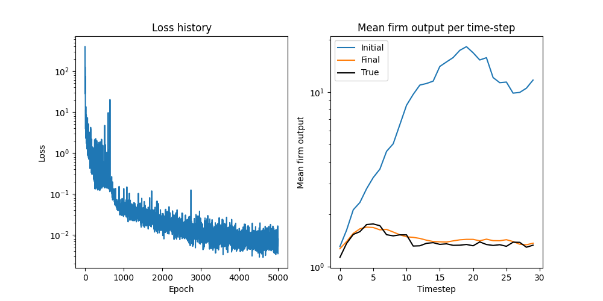

# DiffABM.jl: Differentiable Agent-Based Models in Julia

> [!CAUTION]
> This is still very much an experimental package

This package includes differentiable implementations of 3 popular agent-based models:

1. Axtell Model of Firms
2. Sugarscape
3. Network-based SIR model

## Installation

To install the package locally, simply run

```bash
julia --project
```

```julia
]instantiate
```

## Examples

You can find examples on how to run and differentiate each model in the `scripts` folder.

### Training the Axtell Model with Gradient Descent

Here's a complete example showing how to train the Axtell model parameters using automatic differentiation and gradient descent:

#### 1. Setup and Dependencies

```julia
using DiffABM
using StatsBase
using PyPlot
using Flux
using DifferentiationInterface
using Optimisers
using Random
using Distributions

const DI = DifferentiationInterface
```

We use `DifferentiationInterface.jl` to compute gradients through `ForwardDiff.jl`, `Flux.jl` for parameter handling, and `Optimisers.jl` for the Adam optimizer.

#### 2. Model Configuration

```julia
function make_axtell_params(theta_bounds, initial_effort_bounds, a_bounds, b_bounds)
    n_agents = 500
    n_timesteps = 30
    update_rate = 0.25  # Rate at which agents update their strategies
    delta_t = 1.0
    gradient_horizon = 10000  # Time horizon for gradient computation
    n_neighbors = 4  # Number of neighbors each agent observes

    # Initialize agents with random parameters drawn from specified bounds
    agent_initializer = RandomAxtellAgentInitializer(
        n_agents,
        theta_bounds,
        initial_effort_bounds,
        a_bounds,
        b_bounds,
        n_neighbors)
    return AxtellFirmsParams(
        agent_initializer, update_rate, delta_t, n_timesteps, gradient_horizon)
end
```

This function creates the ABM parameters. The bounds represent parameters for beta distributions that initialize agent characteristics. Each agent observes `n_neighbors` and updates their strategy at rate `update_rate`.

#### 3. Generate Training Data

```julia
# Define parameter bounds for agent initialization (beta distribution parameters)
theta_bounds = [1.0, 2.0]
initial_effort_bounds = [3.0, 4.0]
a_bounds = [5.0, 6.0]
b_bounds = [7.0, 8.0]

# Create ABM parameters and run the model to generate "true" data
abm_params = make_axtell_params(theta_bounds, initial_effort_bounds, a_bounds, b_bounds)
x = abm_run(abm_params)  # x contains [mean_effort, mean_firm_size, mean_firm_output] over time
```

We first run the model with known parameters to generate target data that we'll try to recover through training.

#### 4. Loss Function

```julia
function compute_loss(log_params_flat, y, restruct_f)
    # Loss function: minimize MSE between predicted and true mean firm output
    params_flat = exp.(log_params_flat)  # Transform from log space to ensure positive parameters
    x = abm_run(restruct_f(params_flat))  # Run ABM with current parameters
    return mean((x[3, :] .- y[3, :]) .^ 2)  # MSE on mean firm output (3rd row)
end
```

The loss function:
- Works in log space to ensure parameters stay positive
- Runs the ABM simulation with current parameters
- Computes mean squared error between predicted and target firm output trajectories

#### 5. Training Loop

```julia
function train_model(y, n_epochs)
    # Extract parameter structure from the original ABM parameters
    _, restruct_f = Flux.destructure(abm_params)

    # Initialize with random parameters in log space (8 parameters total)
    log_params_flat = 5 .* rand(8)

    # Set up Adam optimizer with learning rate 0.01
    rule = Optimisers.Adam(0.01)
    state = Optimisers.setup(rule, log_params_flat)

    # Track loss and parameter evolution during training
    loss_history = []
    param_history = []

    # Main training loop
    for i in 1:n_epochs
        # Compute loss and gradients using automatic differentiation
        loss, grad = DifferentiationInterface.value_and_gradient(
            compute_loss, AutoForwardDiff(), log_params_flat, DI.Constant(y), DI.Constant(restruct_f))

        # Store current loss and parameters
        push!(loss_history, loss)
        push!(param_history, copy(log_params_flat))

        # Update parameters using optimizer
        state, log_params_flat = Optimisers.update!(state, log_params_flat, grad)
    end
    return loss_history, param_history
end
```

The training function:
- Uses `Flux.destructure` to handle parameter reshaping
- Initializes 8 random parameters (corresponding to the 4 bound pairs)
- Uses automatic differentiation to compute gradients through the entire ABM simulation
- Updates parameters using Adam optimizer

#### 6. Run Training and Visualize Results

```julia
# Run the training for 2000 epochs
loss_history, param_history = train_model(x, 2000);
loss_history = vcat(loss_history...)  # Convert to flat array
param_history = hcat(param_history...)  # Convert to matrix (params × epochs)

# Visualize training results
fig, ax = plt.subplots(1, 2, figsize = (10, 5));

# Plot loss convergence
ax[1].plot(loss_history)
ax[1].set_yscale("log")
ax[1].set_title("Loss history")
ax[1].set_xlabel("Epoch")
ax[1].set_ylabel("Loss")

# Compare initial vs final parameter performance against true data
_, restruct_f = Flux.destructure(abm_params)

# Run ABM with initial random parameters
params_initial = exp.(param_history[:, 1])
x_initial = abm_run(restruct_f(params_initial))

# Run ABM with final trained parameters
params_final = exp.(param_history[:, end])
x_final = abm_run(restruct_f(params_final))

# Plot comparison of trajectories
ax[2].plot(x_initial[3, :], color = "C0", label = "Initial")
ax[2].plot(x_final[3, :], color = "C1", label = "Final")
ax[2].plot(x[3, :], color = "black", label = "True")
ax[2].legend()
ax[2].set_title("Mean firm output per time-step")
ax[2].set_xlabel("Timestep")
ax[2].set_ylabel("Mean firm output")
```



The complete example is available in [`scripts/train_axtell.jl`](scripts/train_axtell.jl).

## Citation

Please consider citing this work 

```bibtex
@misc{querabofarull2025automaticdifferentiationagentbasedmodels,
      title={Automatic Differentiation of Agent-Based Models}, 
      author={Arnau Quera-Bofarull and Nicholas Bishop and Joel Dyer and Daniel Jarne Ornia and Anisoara Calinescu and Doyne Farmer and Michael Wooldridge},
      year={2025},
      eprint={2509.03303},
      archivePrefix={arXiv},
      primaryClass={cs.MA},
      url={https://arxiv.org/abs/2509.03303}, 
}
```
